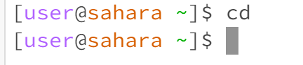
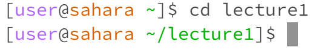
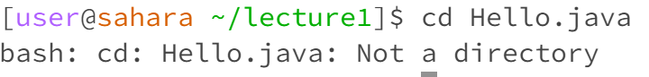

# Week 1 Lab Report
## `cd` command

1. No arguments
  
The working directory was  
Having no arguments means that  

3. Directory argument  

The working directory was  
The directory argument  

4. File argument  

The working directory was  
The directory argument  

## `ls` command
1. No arguments\
The working directory was\
Having no arguments means that\

2. Directory argument\
The working directory was\
The directory argument\

3. File argument\
The working directory was\
The directory argument\

## `cat` command
1. No arguments\
The working directory was\
Having no arguments means that\

2. Directory argument\
The working directory was\
The directory argument\

3. File argument\
The working directory was\
The directory argument\

