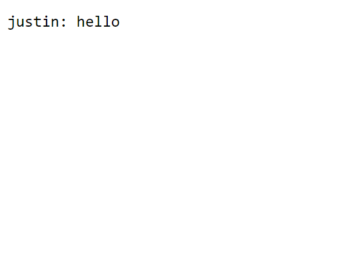
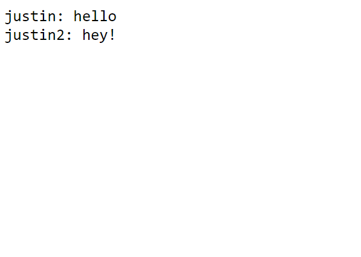
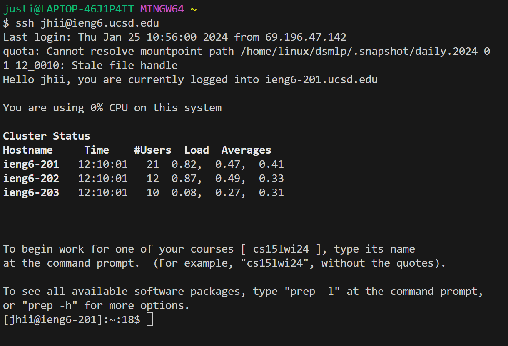
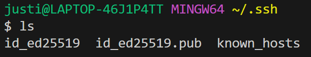

# Week 3 Lab Report

**Part 1: ChatServer Code**  
```
import java.io.IOException;
import java.net.URI;
import java.util.ArrayList;

class Handler implements URLHandler {
    ArrayList<String> something = new ArrayList<String>();

    public String handleRequest(URI url) {
        String query = url.getQuery();

        if (url.getPath().contains("/add-message")) {
                if(query.startsWith("s=")) {
                    System.out.println(query);
                    String msgSplit1 = query.split("=")[1];
                    String msg = msgSplit1.split("&")[0];
                    String user = query.split("=")[2];
                    this.something.add(user + ": " + msg);
                    String somethingList = String.join("\n", something);
                    return somethingList;
                }
        } else if (url.getPath().contains("/")) {
            return "Type in message (/add-message?s=[MESSAGE HERE]&user=[USER HERE])";
        }
            return "404 Not Found!";
        }
}

class ChatServer {
    public static void main(String[] args) throws IOException {
        if(args.length == 0){
            System.out.println("Missing port number! Try any number between 1024 to 49151");
            return;
        }

        int port = Integer.parseInt(args[0]);

        Server.start(port, new Handler());
    }
}
```
  
We call the methods `handleRequest(URI url)`.  
We then define a new string named `query`, which represents our URL query.  
Then, using `.split`, we edit the `query` string to get the `user` (justin) and `msg` (hello).  
Finally, these values are concatenated and added to the end of the ArrayList which is then returned.  
  
We call the methods `handleRequest(URI url)`.  
We then define a new string named `query`, which represents our URL query.  
Then, using `.split`, we edit the `query` string to get the `user` (justin2) and `msg` (hey!).  
Finally, these values are concatenated and added to the end of the ArrayList which is then returned.  

**Part 2: ls screenshots**  
  
  
The path for the private key is: `/c/Users/justi/.ssh/id_ed2519/`  
The path for the public key is: `/c/Users/justi/.ssh/id_ed25519.pub/`  

**Part 3**  
I didn't know how to ssh into the lab computers. A few weeks ago I was messing around with a Raspberry Pi, and I was supposed to ssh into it but I didn't know what ssh meant, so I am really excited that I was able to learn a new term that is applicable to things that I am interested in.
