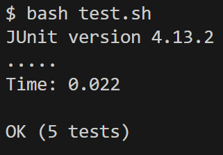
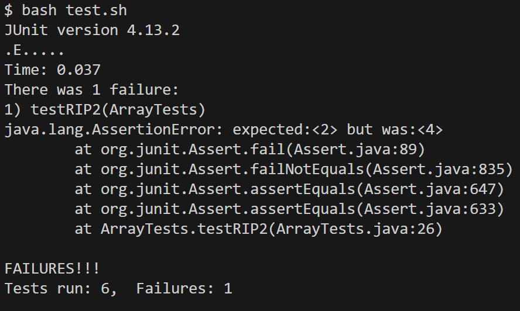

# Week 5 Lab Report
## Part 1 - Bugs
The program below is buggy, in that it doesn't return the expected, reversed output.

```
static void reverseInPlace(int[] arr) {
    for(int i = 0; i < arr.length; i += 1) {
      arr[i] = arr[arr.length - i - 1];
    }
  }
```

However, the JUnit test below passes. We input the array `{ 3 }`.

```
@Test 
	public void testReverseInPlace() {
    int[] input1 = { 3 };
    ArrayExamples.reverseInPlace(input1);
    assertArrayEquals(new int[]{ 3 }, input1);
	}
```
Our JUnit output is as follows:



A failure-inducing input, `{ 1, 2, 3, 4, 5 }` is shown here:

```
@Test
  public void testRIP2() {
    int[] input1 = { 1, 2, 3, 4, 5 };
    ArrayExamples.reverseInPlace(input1);
    assertEquals(5, input1[0]);
    assertEquals(4, input1[1]);
    assertEquals(3, input1[2]);
    assertEquals(2, input1[3]);
    assertEquals(1, input1[4]);
  }
```

Our JUnit output is as follows:



We expect the reversed array to look like this: ` { 5, 4, 3, 2, 1 } `

However, we get an array which looks like this: ` { 5, 4, 3, 4, 5 } `

If we look closer at the buggy code, we see that it uses the final returned array as a template to reverse. This means that the first half of the array acts as a template for the reversal of the rest of the array.

To fix this, we need to change a few lines. We have to create a new array which acts as a blank slate for our input to be reversed onto, so that previous inputs do not affect subsequent inputs.

Our final code will look like this:
```
static void reverseInPlace(int[] arr) {
    int arrCopy[] = arr.clone();
    for(int i = 0; i < arr.length; i += 1) {
      arr[i] = arrCopy[arr.length - 1 - i];
    }
  }
```

## Part 2 - Researching Commands
I am interested about learning more about the `find` command.

<ins> Using the -name argument: </ins>

```
$ find -name chapter-1.txt
./911report/chapter-1.txt
```

This prints the path to the named file, chapter-1.txt. 

```
$ find -name chapter-2.txt
./911report/chapter-2.txt
```

This prints the path to the named file, chapter-2.txt. Both of these commands are useful for finding the path that a certain file resides in.

<ins> Using the -maxdepth argument: </ins>

```
$ find -maxdepth 0
.
```
This argument specifies that we descend 0 directories below our working directory, and print the specified directories. Since we are not descending, we print our working directory of techinical - 0.

```
$ find -maxdepth 1
.
./911report
./biomed
./government
./plos
```

This argument specifies that we descend 1 directory below our working directory, and print the specified directories. Since we are descending by 1, we can print out the directories that are inside of techincal.

<ins> Using the -maxdepth argument: </ins>

```
$ find -size 1k
./plos/pmed.0020191.txt
./plos/pmed.0020226.txt
```
The argument 1k specifies that we are searching for files of size < 1 kibibytes (1024 bytes).

```
$ find -size 2k
./government/Media/Campaign_Pays.txt
./government/Media/Court_Keeps_Judge_From.txt
./government/Media/Fire_Victims_Sue.txt
./government/Media/It_Pays_to_Know.txt
./government/Media/Justice_requests.txt
./government/Media/Lawyer_Web_Survey.txt
./government/Media/Self-Help_Website.txt
./plos/pmed.0020028.txt
./plos/pmed.0020048.txt
./plos/pmed.0020082.txt
./plos/pmed.0020120.txt
./plos/pmed.0020157.txt
./plos/pmed.0020192.txt
```

The argument 2k specifies that we are searching for files of size < 2k kibibytes (2048 bytes).

<ins> Using the -type argument: </ins>

```
$ find -type d
.
./911report
./biomed
./government
./government/About_LSC
./government/Alcohol_Problems
./government/Env_Prot_Agen
./government/Gen_Account_Office
./government/Media
./government/Post_Rate_Comm
./plos
```
Using the argument d, we are searching for directories under the working directory.

```
$ find -type c

```
Using the argument c, we are searching for characters under the working directory. Since there are no characters, we do not print anythiing. 

