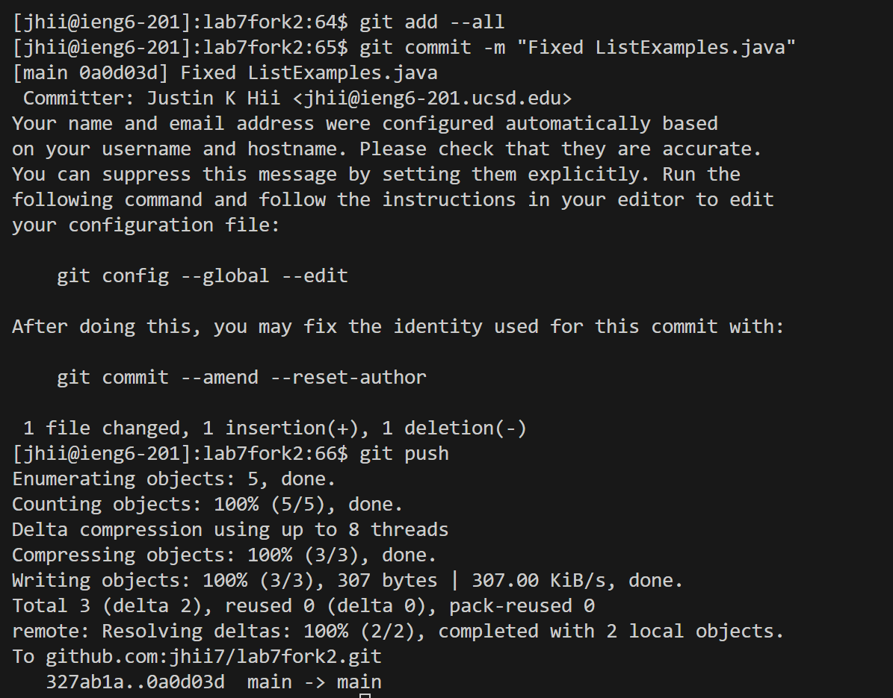

# Week 7 Lab Report
## Vim
### Step 4. 
Keys Pressed: ssh jhii@ieng6.ucsd.edu `<enter>`

SUMMARY: We want to ssh into ieng6.

### Step 5. 
Keys Pressed: git clone git@github.com:jhii7/lab7fork2.git `<enter>`

SUMMARY: We use git clone to clone this repository using the SSH url.

### Step 6. 
Keys Pressed: cd lab7fork2 `<enter>`, bash test.sh `<enter>`

SUMMARY: We need to change directories to our cloned repository, and then we run the bash test.

### Step 7. 
Keys Pressed: vim ListExamples.java `<enter>`, 43j, w, dw, i, index2, , `<esc>`, :wq, `<enter>`

SUMMARY: We run vim on ListExamples.java in order to edit it. Pressing 43j moves us 43 lines down.

Pressing w moves us to the next word. Pressing dw deletes the current word. Pressing i changes us to insert mode.

We now type out "index2 " (without the quotes). 

Finally, we switch back to normal mode using `<esc>` and then we save and exit with :wq.

### Step 8. 
Keys Pressed: bash test.sh `<enter>`

SUMMARY: We run the tests again, and we get a successful result.

### Step 9. 
Keys Pressed: git add --all `<enter>`, git commit -m "Fixed ListExamples.java" `<enter>`, git push `<enter>`

SUMMARY: Here, we add our files to the staging area, commit them with the message "Fixed ListExamples.java", and then push them to our fork. 

